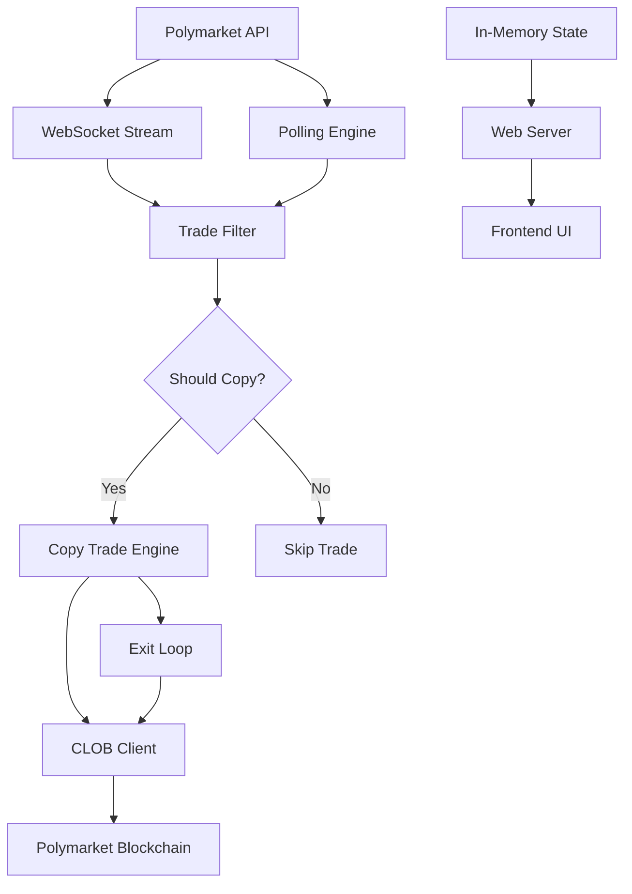
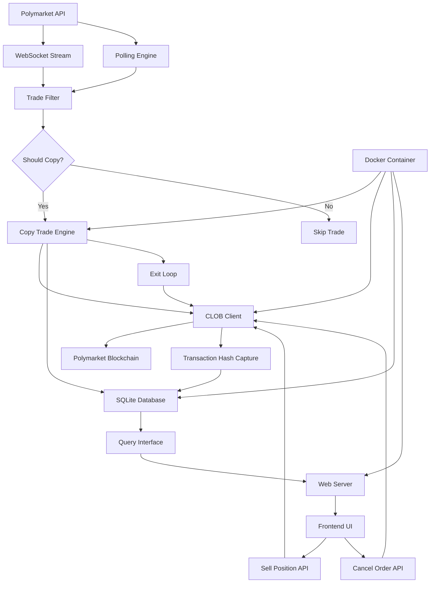
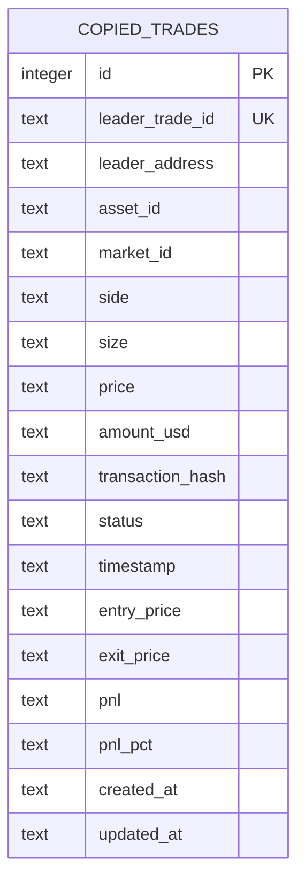
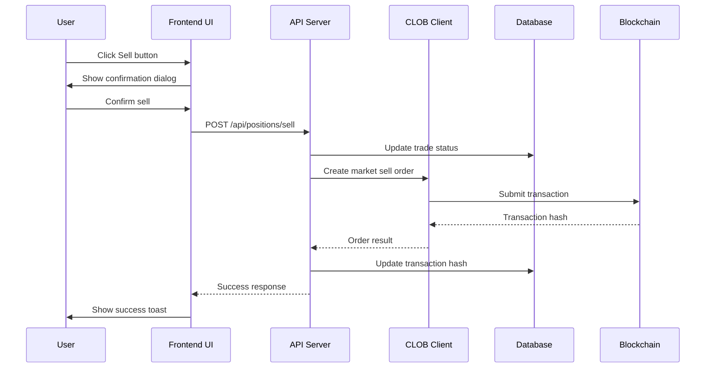

# Polymarket Copy Trading Bot - Product Requirements Document (PRD)

## Table of Contents
1. [Executive Summary](#executive-summary)
2. [Current Functionality](#current-functionality)
3. [Future Roadmap](#future-roadmap)
4. [Technical Specifications](#technical-specifications)
5. [Implementation Plan](#implementation-plan)

---

## Executive Summary

Polymarket Copytrading Bot is an automated trading system that copies trades from one or more leader addresses on Polymarket. The bot is designed for disciplined copy trading across multiple market types (Politics, Sports, Crypto, Economic events, etc.) with built-in risk controls and automated exit strategies.

### Current State
- High-performance copy trading system with low-latency execution
- Support for multiple target addresses (websocket mode for single target, polling mode for multiple)
- Configurable filters, position sizing, and automated exit strategies
- Real-time web UI for monitoring trades and positions
- Simulation mode for testing without real trades

### Strategic Direction
The bot is being enhanced with three major improvements:
1. **Persistence Layer** - SQLite database to track all copied orders and prevent double spending
2. **Transaction Tracking** - Record specific transaction addresses for each copied order
3. **UI Enhancement** - Manual cancel/sell functionality for positions
4. **Deployment** - Docker containerization for easier deployment and portability

---

## Current Functionality

### Journey of Builder - [xstacks](https://t.me/x_stacks)

While many traders focus heavily on crypto prediction markets, I noticed that they can be extremely volatile and unpredictable in short timeframes. Rapid price swings, aggressive position flipping, and sudden liquidity shifts make consistent automation difficult.

When I started looking at Polymarket, I noticed one thing right away: markets can be unpredictable. Crypto markets, in particular, move fast—prices swing, positions flip, and liquidity can change in an instant, making consistent automation really tricky.

Instead of limiting the bot to one type of market, I decided to build a system that could copy trades across all kinds of markets—Politics, Sports, Crypto, Economic events, and more. The idea was simple: follow experienced traders, act quickly, and stay flexible, no matter what market they're in.

I started development in early February 2026, spending a couple of weeks testing, refining filters, timing logic, and position sizes. Running simulations on historical data and testing with a small live balance showed promising results: steady, consistent gains without chasing extreme volatility.

The strategy isn't about explosive wins. It's about disciplined copy trading, spreading risk across multiple markets, and aiming for smooth, reliable performance. By following multiple leaders and diversifying trades, the bot can handle fast-moving markets like sports and crypto while still keeping long-term events, like politics and macroeconomics, in play.

In short, it's a long-term, flexible system built for steady growth, smart risk control, and automated trading across the full spectrum of Polymarket.
This is a long-term strategy — built around discipline, diversification, and steady growth rather than hype.

### Market Types

- **Polymarket includes** Politics, Sports, Crypto, Economic, Geopolitical, Entertainment, and Experimental markets.
- **Politics & Macro markets** are longer-term and news-driven, suitable for medium-term copy strategies.
- **Sports & Crypto markets** are fast-moving and require quick execution (websocket mode recommended).
- **Entertainment markets** tend to be slower and lower volatility.
- **Experimental / low-liquidity markets** carry higher slippage risk and should use size limits.

Adjust filters like `entry_trade_sec`, `trade_sec_from_resolve`, `take_profit`, and `buy_amount_limit_in_usd` based on the market's volatility and duration.

### Current Features

#### Core Trading Engine
- **Real-time Trade Copying**: Monitors leader addresses and automatically copies their trades
- **Multi-Target Support**: Copy from multiple leader addresses simultaneously
- **Position Sizing**: Configurable size multiplier to scale copied trades
- **Order Types**: FOK (Fill-or-Kill) orders for immediate execution

#### Risk Management
- **Take Profit**: Automatic sell when position reaches target profit percentage
- **Stop Loss**: Automatic sell when position reaches loss threshold
- **Trailing Stop**: Lock in gains as price moves favorably
- **Size Limits**: Maximum USD amount per trade to control exposure

#### Filters
- **Entry Time Filter**: Only copy trades made within N seconds of market entry
- **Resolve Time Filter**: Skip markets resolving within N seconds
- **Buy Amount Limit**: Cap maximum USD spent per trade

#### Monitoring & UI
- **Real-time Dashboard**: Web-based interface for monitoring bot status
- **Live Positions Panel**: View current positions with delta tracking
- **Trade Logs**: Complete history of copied trades with status
- **Settings Page**: Configure bot parameters through UI

#### Execution Modes
- **Simulation Mode**: Test strategies without executing real trades
- **Live Mode**: Execute real trades with wallet integration
- **Websocket Mode**: Low-latency real-time updates (single target)
- **Polling Mode**: Periodic position checks (multiple targets)

### Current Architecture

```
┌─────────────────────────────────────────────────────────────┐
│                     Polymarket API                           │
└────────────────────────┬────────────────────────────────────┘
                         │
         ┌───────────────┴───────────────┐
         │                               │
         ▼                               ▼
┌─────────────────┐           ┌─────────────────┐
│  Websocket      │           │  Polling        │
│  Stream         │           │  Engine         │
└────────┬────────┘           └────────┬────────┘
         │                             │
         └──────────────┬──────────────┘
                        │
                        ▼
              ┌─────────────────┐
              │  Trade Filter   │
              └────────┬────────┘
                       │
        ┌──────────────┴──────────────┐
        │                             │
        ▼                             ▼
┌───────────────┐           ┌───────────────┐
│  Copy Trade   │           │  Exit Loop    │
│  Engine       │           │  (TP/SL/TS)   │
└───────┬───────┘           └───────┬───────┘
        │                           │
        └───────────┬───────────────┘
                    │
                    ▼
          ┌─────────────────┐
          │  CLOB Client    │
          │  (Execution)    │
          └────────┬────────┘
                   │
                   ▼
          ┌─────────────────┐
          │  Polymarket     │
          │  Blockchain     │
          └─────────────────┘
```

### Setup

```bash
git clone https://github.com/dev-protocol/polymarket-copytrading-bot-sport.git
cd polymarket-copytrading-bot-sport
npm install
# Edit .env: WALLET_PRIVATE_KEY, PROXY_WALLET_ADDRESS (if Magic), SIGNATURE_TYPE
cd frontend
npm install
# Install for UI
cd ..
npm run dev
```

### Advanced Polymarket Trading Bot

I have developed an advanced Polymarket trading bot, including a high-performance Rust-based copy trading system optimized for low-latency execution, as well as an AI agent trading bot built in TypeScript with automated strategy logic. 

The architecture is designed for speed, efficiency, and scalability, making it suitable for serious traders looking to automate and optimize their activity in prediction markets. If you are interested in purchasing or learning more about the system and its capabilities, feel free to contact me directly.

TG: [xstacks](https://t.me/x_stacks)

### Run

```bash
npm run dev    # tsx src/index.ts
```

### Environment Variables

- `WALLET_PRIVATE_KEY` – EOA or Magic export
- `PROXY_WALLET_ADDRESS` – Polymarket profile (required for Magic; optional EOA)
- `SIGNATURE_TYPE` – 0 = EOA, 1 = Magic/proxy, 2 = Gnosis Safe

### Target Wallets

|Address|Profile|Pnl|
|-|-|-|
|0x6031b6eed1c97e853c6e0f03ad3ce3529351f96d|@gabagool22||
|0x63ce342161250d705dc0b16df89036c8e5f9ba9a|@0x8dxd||
|0xa61ef8773ec2e821962306ca87d4b57e39ff0abd|@risk-manager||
|0x781a48229e2c08e20d1eaad90ef73710988c96e6|@100USDollars||
|0x0ac97e4f5c542cd98c226ae8e1736ae78b489641|@7thStaircase||
|0x1d0034134e339a309700ff2d34e99fa2d48b0313|@0x1d0034134e||
|0xa9878e59934ab507f9039bcb917c1bae0451141d|@ilovecircle||
|0xd0d6053c3c37e727402d84c14069780d360993aa|@k9Q2mX4L8A7ZP3R||
|0x594edB9112f526Fa6A80b8F858A6379C8A2c1C11|@0x594...1C11||
|0x1979ae6B7E6534dE9c4539D0c205E582cA637C9D|@0x197...7C9D||
|0x4460bf2c0aa59db412a6493c2c08970797b62970|@Bidou28old||
|0x0eA574F3204C5c9C0cdEad90392ea0990F4D17e4|@0x0eA...17e4||
|0x118689b24aead1d6e9507b8068d056b2ec4f051b|@russell110320||
|0x13414a77a4be48988851c73dfd824d0168e70853|@czoyimsezblaznili||

---

## Future Roadmap

### Phase 1: Persistence Layer (SQLite Database)

#### Problem Statement
Currently, the bot does not persist copied trade information. On restart, there is no record of which trades have been copied, leading to potential double-spending issues if the same leader trade is processed again.

#### Solution Overview
Implement a SQLite database to persist all copied orders with transaction details, enabling the bot to:
- Track all executed copied trades
- Prevent duplicate copying of the same trade on restart
- Maintain a complete audit trail of all bot activity
- Enable future features like position reconciliation and analytics

#### Functional Requirements

**FR-1.1: Database Schema**
- Create SQLite database file (`polymarket-bot.db`)
- Define schema for storing copied trades with the following fields:
  - `id`: Primary key (auto-increment)
  - `leader_trade_id`: Unique identifier from leader trade (transactionHash + timestamp)
  - `leader_address`: Address of the trader being copied
  - `asset_id`: Polymarket asset/token identifier
  - `market_id`: Market condition ID
  - `side`: BUY or SELL
  - `size`: Trade size in tokens
  - `price`: Price per token
  - `amount_usd`: Total USD value of the trade
  - `transaction_hash`: Transaction hash of the executed order (to be filled)
  - `status`: PENDING, FILLED, FAILED
  - `timestamp`: ISO timestamp when trade was copied
  - `entry_price`: Average entry price (for BUY orders)
  - `exit_price`: Exit price (when position is closed)
  - `pnl`: Profit/Loss in USD
  - `pnl_pct`: Profit/Loss percentage

**FR-1.2: Trade Recording**
- Record every trade copy attempt to the database
- Update record status as trade execution progresses
- Store transaction hash after successful execution
- Handle database errors gracefully without interrupting trading

**FR-1.3: Duplicate Prevention**
- Before copying a trade, check database for existing records with same `leader_trade_id`
- Skip copying if trade already exists and status is FILLED
- Allow re-attempt if previous status is FAILED (configurable)
- Log duplicate detection events

**FR-1.4: Data Persistence**
- Database file location: `data/polymarket-bot.db`
- Automatic database initialization on first run
- Database migration support for schema updates
- Regular backups (optional feature)

**FR-1.5: Query Interface**
- Functions to query trade history by:
  - Time range
  - Leader address
  - Market/asset
  - Status
  - PnL metrics
- Export functionality for analytics (CSV/JSON)

#### Non-Functional Requirements

**NFR-1.1: Performance**
- Database writes should not block trade execution
- Use async/await for all database operations
- Index on `leader_trade_id` for fast duplicate checks
- Index on `timestamp` for time-based queries

**NFR-1.2: Reliability**
- Database connection pooling
- Automatic reconnection on connection loss
- Transaction support for data consistency
- Error logging for database operations

**NFR-1.3: Security**
- Database file permissions (read/write for owner only)
- SQL injection prevention (use parameterized queries)
- No sensitive data in database (private keys, etc.)

#### Technical Specifications

**Database Library**
- Use `better-sqlite3` or `sqlite3` npm package
- TypeScript support with type definitions

**Schema Definition**
```sql
CREATE TABLE IF NOT EXISTS copied_trades (
  id INTEGER PRIMARY KEY AUTOINCREMENT,
  leader_trade_id TEXT NOT NULL UNIQUE,
  leader_address TEXT NOT NULL,
  asset_id TEXT NOT NULL,
  market_id TEXT NOT NULL,
  side TEXT NOT NULL,
  size TEXT NOT NULL,
  price TEXT NOT NULL,
  amount_usd TEXT NOT NULL,
  transaction_hash TEXT,
  status TEXT NOT NULL DEFAULT 'PENDING',
  timestamp TEXT NOT NULL,
  entry_price TEXT,
  exit_price TEXT,
  pnl TEXT,
  pnl_pct TEXT,
  created_at TEXT DEFAULT CURRENT_TIMESTAMP,
  updated_at TEXT DEFAULT CURRENT_TIMESTAMP
);

CREATE INDEX IF NOT EXISTS idx_leader_trade_id ON copied_trades(leader_trade_id);
CREATE INDEX IF NOT EXISTS idx_leader_address ON copied_trades(leader_address);
CREATE INDEX IF NOT EXISTS idx_timestamp ON copied_trades(timestamp);
CREATE INDEX IF NOT EXISTS idx_status ON copied_trades(status);
```

**Integration Points**
- Modify `copyTrade()` function in `src/trading/trading.ts` to record trades
- Add duplicate check before trade execution
- Update transaction hash after successful order fill
- Integrate with `recordEntry()` for entry price tracking

---

### Phase 2: Transaction Address Tracking

#### Problem Statement
The bot currently executes trades but does not store the specific transaction addresses (transaction hashes) for each copied order. This information is critical for:
- Manual position management through the UI
- Audit and reconciliation
- Debugging and troubleshooting
- Future features like position tracking and analytics

#### Solution Overview
Capture and store the transaction hash for each executed trade, linking it to the corresponding copied trade record in the database.

#### Functional Requirements

**FR-2.1: Transaction Hash Capture**
- Capture transaction hash from CLOB client response after order execution
- Store transaction hash in the `copied_trades` table
- Handle cases where transaction hash is not immediately available

**FR-2.2: Transaction Status Tracking**
- Track transaction status (PENDING, CONFIRMED, FAILED)
- Update transaction status as blockchain confirms
- Retry mechanism for failed transactions

**FR-2.3: Transaction Lookup**
- Query trades by transaction hash
- Display transaction hash in UI
- Link to blockchain explorer (optional)

**FR-2.4: Reconciliation**
- Periodic reconciliation of database records with blockchain
- Identify and flag discrepancies
- Manual reconciliation tools (optional)

#### Technical Specifications

**CLOB Client Integration**
- Modify `createAndPostMarketOrder()` call to capture response
- Extract transaction hash from order response
- Handle response format variations

**Database Updates**
- Update `copied_trades` record with transaction hash
- Update status to FILLED when transaction is confirmed

**Error Handling**
- Handle cases where transaction hash is not returned
- Implement retry logic with exponential backoff
- Log failed transactions for manual review

---

### Phase 3: Frontend UI Enhancement - Manual Cancel/Sell

#### Problem Statement
Users currently cannot manually close positions through the web UI. All position closures are handled automatically by the exit loop (take profit, stop loss, trailing stop). Users need the ability to:
- Manually sell positions at current market price
- Cancel pending orders
- Have more control over their portfolio management

#### Solution Overview
Add a "Sell Position" button to the Positions Panel in the frontend UI that allows users to manually sell a position at the current market price.

#### Functional Requirements

**FR-3.1: Sell Button UI**
- Add "Sell" button to each position in the Positions Panel
- Button should be visible only for positions with positive size
- Show confirmation dialog before executing sell
- Display current market price and estimated proceeds

**FR-3.2: Sell Execution**
- Execute market sell order at current price
- Use FOK order type for immediate execution
- Handle partial fills and failures
- Update position display after successful sell

**FR-3.3: Order Cancellation**
- Add "Cancel" button for pending orders (if applicable)
- Cancel order through CLOB client
- Update order status in database

**FR-3.4: Position Display**
- Show transaction hash for each position
- Link to blockchain explorer
- Display entry price, current price, and PnL
- Show position age (time since entry)

**FR-3.5: Error Handling**
- Display error messages for failed sells
- Show loading state during order execution
- Disable buttons during execution
- Log errors for debugging

#### Non-Functional Requirements

**NFR-3.1: User Experience**
- Clear visual feedback for button states
- Confirmation dialogs prevent accidental sells
- Real-time price updates
- Responsive design for mobile devices

**NFR-3.2: Performance**
- Fast order execution
- Minimal UI latency
- Efficient polling for price updates

**NFR-3.3: Security**
- Authentication/authorization for sell operations
- CSRF protection
- Input validation

#### Technical Specifications

**Frontend Changes**
- Modify `PositionsPanel.tsx` to add Sell button
- Add confirmation modal component
- Create API client methods for sell operations
- Update position state after sell

**Backend Changes**
- Add API endpoint for manual sell: `POST /api/positions/sell`
- Add API endpoint for order cancellation: `POST /api/orders/cancel`
- Integrate with CLOB client for order execution
- Update database records after successful operations

**API Endpoints**
```
POST /api/positions/sell
Request body:
{
  "asset_id": "string",
  "size": number,
  "price": number
}

Response:
{
  "success": boolean,
  "transaction_hash": "string",
  "error": "string"
}

POST /api/orders/cancel
Request body:
{
  "order_id": "string"
}

Response:
{
  "success": boolean,
  "error": "string"
}
```

**UI Components**
- Sell button with confirmation
- Loading spinner during execution
- Success/error toasts
- Transaction hash display with explorer link

---

### Phase 4: Dockerization

#### Problem Statement
The bot currently requires manual setup of Node.js environment, dependencies, and configuration files. This makes deployment across different machines challenging and error-prone. Users need a simpler, more portable deployment method.

#### Solution Overview
Containerize the application using Docker, providing a consistent runtime environment and simplified deployment process.

#### Functional Requirements

**FR-4.1: Docker Image**
- Create multi-stage Dockerfile for optimized image size
- Include all dependencies and application code
- Support both development and production configurations
- Tag images with version numbers

**FR-4.2: Docker Compose**
- Create docker-compose.yml for easy deployment
- Include bot service and optional services (database, monitoring)
- Configure environment variables
- Define volume mounts for data persistence

**FR-4.3: Configuration**
- Support environment-based configuration
- Allow override of config files via volumes
- Document all configurable parameters
- Provide example configuration files

**FR-4.4: Data Persistence**
- Mount volumes for database file
- Mount volumes for logs
- Backup and restore procedures
- Data migration between versions

**FR-4.5: Health Checks**
- Implement health check endpoint
- Monitor bot status
- Automatic restart on failure
- Logging for troubleshooting

#### Non-Functional Requirements

**NFR-4.1: Image Size**
- Optimize for small image size (< 500MB)
- Use Alpine Linux base image
- Remove unnecessary dependencies

**NFR-4.2: Security**
- Run as non-root user
- Scan images for vulnerabilities
- Use specific version tags
- Don't include .env files in image

**NFR-4.3: Portability**
- Support multiple architectures (amd64, arm64)
- Cross-platform compatibility
- Clear documentation for different platforms

**NFR-4.4: Maintainability**
- Version control for Dockerfiles
- Automated build pipeline (CI/CD)
- Clear upgrade procedures

#### Technical Specifications

**Dockerfile Structure**
```dockerfile
# Base stage
FROM node:20-alpine AS base
WORKDIR /app
COPY package*.json ./
RUN npm ci --only=production

# Build stage
FROM base AS build
COPY . .
RUN npm run build

# Production stage
FROM node:20-alpine AS production
WORKDIR /app
COPY --from=base /app/node_modules ./node_modules
COPY --from=build /app/dist ./dist
COPY --from=build /app/frontend/dist ./frontend/dist
COPY trade.toml ./
COPY .env.example ./.env.example
EXPOSE 8000
CMD ["node", "dist/index.js"]
```

**Docker Compose**
```yaml
version: '3.8'

services:
  polymarket-bot:
    build: .
    container_name: polymarket-bot
    restart: unless-stopped
    ports:
      - "8000:8000"
    volumes:
      - ./data:/app/data
      - ./trade.toml:/app/trade.toml:ro
      - ./.env:/app/.env:ro
    environment:
      - NODE_ENV=production
    healthcheck:
      test: ["CMD", "wget", "--quiet", "--tries=1", "--spider", "http://localhost:8000/health"]
      interval: 30s
      timeout: 10s
      retries: 3
      start_period: 40s
```

**Build and Run Commands**
```bash
# Build image
docker build -t polymarket-bot:latest .

# Run with docker-compose
docker-compose up -d

# Run standalone
docker run -d \
  --name polymarket-bot \
  -p 8000:8000 \
  -v $(pwd)/data:/app/data \
  -v $(pwd)/trade.toml:/app/trade.toml:ro \
  -v $(pwd)/.env:/app/.env:ro \
  polymarket-bot:latest

# View logs
docker logs -f polymarket-bot

# Stop container
docker stop polymarket-bot
```

**Documentation**
- Docker setup guide
- Environment variable reference
- Volume configuration
- Troubleshooting common issues
- Upgrade instructions

---

## Technical Specifications

### Technology Stack

**Backend**
- Runtime: Node.js 20+
- Language: TypeScript
- Database: SQLite 3
- Web Server: Express.js (via CLOB client)
- WebSocket: ws
- Big Number Arithmetic: big.js

**Frontend**
- Framework: React 18
- Build Tool: Vite
- Styling: Tailwind CSS
- State Management: React hooks
- API: Fetch API

**Blockchain**
- Network: Polygon (Matic) - Chain ID 137
- CLOB Client: @polymarket/clob-client
- Wallet: Ethers.js v5

### Project Structure

```
polymarket-copytrading-bot-sport/
├── src/
│   ├── config/           # Configuration loading
│   ├── constant/         # Constants and enums
│   ├── db/               # Database layer (NEW)
│   ├── realtime/         # WebSocket and polling
│   ├── trading/          # Trading logic
│   ├── types/            # TypeScript types
│   ├── web/              # Web server and state
│   └── index.ts          # Main entry point
├── frontend/
│   └── src/
│       ├── api/          # API client
│       ├── components/   # Reusable components
│       ├── features/     # Feature modules
│       └── types/        # TypeScript types
├── data/                 # Data directory (NEW)
│   └── polymarket-bot.db # SQLite database (gitignored)
├── Dockerfile            # Docker image definition (NEW)
├── docker-compose.yml    # Docker Compose config (NEW)
├── trade.toml            # Bot configuration
├── .env                  # Environment variables (gitignored)
└── package.json          # Dependencies and scripts
```

### Database Schema

**copied_trades Table**
| Column | Type | Description |
|--------|------|-------------|
| id | INTEGER | Primary key |
| leader_trade_id | TEXT | Unique identifier from leader trade |
| leader_address | TEXT | Address of trader being copied |
| asset_id | TEXT | Polymarket asset/token ID |
| market_id | TEXT | Market condition ID |
| side | TEXT | BUY or SELL |
| size | TEXT | Trade size in tokens |
| price | TEXT | Price per token |
| amount_usd | TEXT | Total USD value |
| transaction_hash | TEXT | Transaction hash of executed order |
| status | TEXT | PENDING, FILLED, FAILED |
| timestamp | TEXT | ISO timestamp |
| entry_price | TEXT | Average entry price |
| exit_price | TEXT | Exit price |
| pnl | TEXT | Profit/Loss in USD |
| pnl_pct | TEXT | Profit/Loss percentage |
| created_at | TEXT | Record creation time |
| updated_at | TEXT | Last update time |

### API Endpoints

**Existing Endpoints**
- `GET /` - Web UI
- `GET /api/state` - Current bot state
- `GET /api/positions` - Current positions

**New Endpoints**
- `POST /api/positions/sell` - Manual sell position
- `POST /api/orders/cancel` - Cancel pending order
- `GET /api/trades` - Trade history
- `GET /api/trades/:id` - Trade details
- `GET /api/health` - Health check

### Configuration

**trade.toml**
```toml
[clob_host = "https://clob.polymarket.com"
chain_id = 137
port = 8000
simulation = false

[copy]
target_address = ["0x1979ae6B7E6534dE9c4539D0c205E582cA637C9D"]
size_multiplier = 0.005
poll_interval_sec = 15

[exit]
take_profit = 50
stop_loss = 25
trailing_stop = 0

[filter]
buy_amount_limit_in_usd = 5
entry_trade_sec = 0
trade_sec_from_resolve = 0

[ui]
delta_highlight_sec = 10
delta_animation_sec = 2
```

**Environment Variables**
```
WALLET_PRIVATE_KEY=your_private_key_here
PROXY_WALLET_ADDRESS=your_proxy_wallet_address
SIGNATURE_TYPE=0
NODE_ENV=production
```

---

## Implementation Plan

### Phase 1: Persistence Layer

**Tasks**
1. Set up SQLite database infrastructure
   - Install better-sqlite3 package
   - Create database initialization module
   - Define database schema
   - Create migration system

2. Integrate database with trading logic
   - Modify copyTrade() to record trades
   - Add duplicate check before execution
   - Update transaction hash after fill
   - Handle database errors

3. Implement query interface
   - Create database query functions
   - Add time-based filtering
   - Add leader address filtering
   - Add status filtering

4. Testing
   - Unit tests for database operations
   - Integration tests with trading logic
   - Test duplicate prevention
   - Test error handling

**Dependencies**
- better-sqlite3 or sqlite3
- @types/better-sqlite3 (if using better-sqlite3)

**Files to Create**
- `src/db/index.ts` - Database initialization and connection
- `src/db/schema.ts` - Schema definitions
- `src/db/queries.ts` - Query functions
- `src/db/migrations/` - Migration files

**Files to Modify**
- `src/trading/trading.ts` - Integrate database recording
- `src/index.ts` - Initialize database on startup
- `.gitignore` - Add `data/*.db`

### Phase 2: Transaction Address Tracking

**Tasks**
1. Capture transaction hash from CLOB client
   - Inspect CLOB client response structure
   - Extract transaction hash
   - Handle missing hash scenarios

2. Update database with transaction hash
   - Update copied_trades record
   - Update status to FILLED
   - Handle update failures

3. Implement transaction status tracking
   - Poll blockchain for transaction confirmation
   - Update transaction status
   - Implement retry logic

4. Testing
   - Test transaction hash capture
   - Test database updates
   - Test status tracking
   - Test error scenarios

**Files to Modify**
- `src/trading/trading.ts` - Capture and store transaction hash
- `src/db/queries.ts` - Add update functions

### Phase 3: Frontend UI Enhancement

**Tasks**
1. Backend API development
   - Create sell position endpoint
   - Create cancel order endpoint
   - Add request validation
   - Add error handling

2. Frontend UI development
   - Add Sell button to PositionsPanel
   - Create confirmation modal
   - Add loading states
   - Add error/success toasts

3. Integrate with database
   - Query positions with transaction hashes
   - Display transaction information
   - Link to blockchain explorer

4. Testing
   - Test sell functionality
   - Test cancel functionality
   - Test error handling
   - Test UI responsiveness

**Files to Create**
- `frontend/src/components/SellModal.tsx` - Sell confirmation modal
- `frontend/src/components/TransactionLink.tsx` - Transaction hash display

**Files to Modify**
- `frontend/src/features/positions/PositionsPanel.tsx` - Add Sell button
- `frontend/src/api/client.ts` - Add API methods
- `src/web/server.ts` - Add API endpoints
- `src/db/queries.ts` - Add position queries

### Phase 4: Dockerization

**Tasks**
1. Create Dockerfile
   - Set up multi-stage build
   - Optimize image size
   - Configure entry point
   - Add health check

2. Create docker-compose.yml
   - Define bot service
   - Configure volumes
   - Set up environment variables
   - Add health checks

3. Documentation
   - Write Docker setup guide
   - Document configuration
   - Create troubleshooting guide
   - Add upgrade instructions

4. Testing
   - Test image build
   - Test container startup
   - Test data persistence
   - Test upgrades

**Files to Create**
- `Dockerfile` - Docker image definition
- `docker-compose.yml` - Docker Compose configuration
- `docs/DOCKER_SETUP.md` - Docker setup guide
- `.dockerignore` - Docker ignore file

**Files to Modify**
- `.gitignore` - Add Docker-related ignores
- `README.md` - Add Docker setup instructions

---

## Success Criteria

### Phase 1: Persistence Layer
- [ ] Database is automatically initialized on first run
- [ ] All copied trades are recorded in the database
- [ ] Duplicate trades are prevented on restart
- [ ] Database queries perform efficiently (< 100ms)
- [ ] Database file is properly gitignored
- [ ] No data loss on application crash

### Phase 2: Transaction Address Tracking
- [ ] Transaction hashes are captured for all executed trades
- [ ] Transaction hashes are stored in the database
- [ ] Transaction status is tracked and updated
- [ ] Failed transactions are logged and retried
- [ ] Transaction information is displayed in UI

### Phase 3: Frontend UI Enhancement
- [ ] Sell button is visible for all positions
- [ ] Sell confirmation dialog works correctly
- [ ] Sell orders execute successfully
- [ ] Positions are updated after sell
- [ ] Transaction hashes are displayed with explorer links
- [ ] Error messages are clear and actionable

### Phase 4: Dockerization
- [ ] Docker image builds successfully
- [ ] Container starts without errors
- [ ] Bot runs correctly in container
- [ ] Data persists across container restarts
- [ ] Health check endpoint works
- [ ] Documentation is complete and accurate

---

## Risk Assessment

### Technical Risks

**Risk 1: Database Performance**
- **Impact**: High - Slow database queries could delay trade execution
- **Mitigation**: Use proper indexing, async operations, connection pooling
- **Contingency**: Implement caching layer if needed

**Risk 2: Transaction Hash Not Available**
- **Impact**: Medium - Some trades may not have immediate transaction hash
- **Mitigation**: Implement polling mechanism, handle delayed responses
- **Contingency**: Manual reconciliation tools

**Risk 3: Docker Image Size**
- **Impact**: Low - Large images may slow deployment
- **Mitigation**: Multi-stage builds, Alpine base, dependency optimization
- **Contingency**: Accept larger size if optimization compromises functionality

**Risk 4: UI Latency**
- **Impact**: Medium - Slow UI could affect user experience
- **Mitigation**: Efficient polling, optimistic updates, loading states
- **Contingency**: Implement WebSocket for real-time updates

### Operational Risks

**Risk 1: Data Loss**
- **Impact**: High - Loss of trade history and position data
- **Mitigation**: Regular backups, volume persistence, transaction support
- **Contingency**: Implement data recovery procedures

**Risk 2: Deployment Issues**
- **Impact**: Medium - Docker deployment may have platform-specific issues
- **Mitigation**: Multi-architecture support, thorough testing
- **Contingency**: Provide alternative deployment methods

**Risk 3: Configuration Errors**
- **Impact**: High - Incorrect configuration could cause financial loss
- **Mitigation**: Configuration validation, clear documentation, examples
- **Contingency**: Simulation mode for testing

---

## Timeline

### Phase 1: Persistence Layer
- Database setup: 2-3 days
- Integration with trading: 2-3 days
- Query interface: 1-2 days
- Testing: 2-3 days
- **Total: 7-11 days**

### Phase 2: Transaction Address Tracking
- Transaction hash capture: 1-2 days
- Database updates: 1 day
- Status tracking: 2-3 days
- Testing: 1-2 days
- **Total: 5-8 days**

### Phase 3: Frontend UI Enhancement
- Backend API: 2-3 days
- Frontend UI: 3-4 days
- Integration: 1-2 days
- Testing: 2-3 days
- **Total: 8-12 days**

### Phase 4: Dockerization
- Dockerfile creation: 1-2 days
- Docker Compose: 1 day
- Documentation: 2-3 days
- Testing: 1-2 days
- **Total: 5-8 days**

**Overall Timeline: 25-39 days** (approximately 5-8 weeks)

---

## Dependencies and Blockers

### External Dependencies
- Polymarket CLOB API stability
- @polymarket/clob-client library updates
- Polygon network availability
- SQLite library maintenance

### Internal Dependencies
- Phase 2 depends on Phase 1 completion
- Phase 3 depends on Phase 2 completion
- Phase 4 can be done in parallel with other phases

### Blockers
- None identified at this time

---

## Open Questions

1. **Database Backup Strategy**: Should automatic backups be implemented, or should this be left to the user?
2. **Transaction Confirmation Time**: How long should we wait for transaction confirmation before marking as failed?
3. **Sell Order Size**: Should users be able to sell partial positions, or only full positions?
4. **Docker Registry**: Should Docker images be published to a public registry (Docker Hub, GitHub Container Registry)?
5. **Monitoring**: Should we add monitoring/alerting capabilities (Prometheus, Grafana)?
6. **Analytics**: Should we add built-in analytics dashboards for PnL tracking?

---

## Appendix

### A. Current Architecture Diagram



### B. Future Architecture Diagram (with all phases)



### C. Database ER Diagram



### D. API Flow Diagram (Manual Sell)



---

## Change Log

| Version | Date | Changes | Author |
|---------|------|---------|--------|
| 1.0 | 2026-03-04 | Initial PRD creation | System |

---

## Approval

| Role | Name | Date | Signature |
|------|------|------|-----------|
| Product Owner | | | |
| Technical Lead | | | |
| Developer | | | |

---

*End of PRD*
